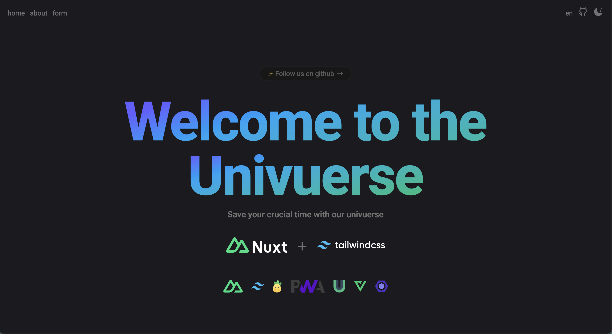

# Nuxt Starter Pack

> Save your crucial time with our collection of Nuxt + Tailwind CSS setup for your project

<p align="center">

</p>

<h2 align="center">
<a href="https://github.com/The-Univuerse/nuxt-tailwind-starter-pack">Nuxt Starter Pack</a> for Nuxt 3
</h2>
<br>

## Features

 [Nuxt v3](https://nuxt.com/) - SSR, ESR, File-based routing, components auto importing, modules, etc.

 [Vite](https://vite.dev/) - Next generation frontend tooling. It's fast!

 [Tailwindcss v4](https://tailwindcss.com/) - A utility-first CSS framework for rapid UI development.

 [Vite](https://github.com/nuxt/icon) - 200,000+ ready to use icons from [iconify](https://icon-sets.iconify.design/)

 Typescript, Don't worry about that. Nuxt will be handle it

 Pinia, The intuitive store for Vue.js. [(./stores/numberCounter.ts)](https://github.com/The-Univuerse/nuxt-tailwind-starter-pack/blob/main/stores/numberCounter.ts)

 [VueUse](https://vueuse.org/) - Collection of Essential Vue Composition Utilities

 [PWA](https://vite-pwa-org.netlify.app/) - Zero Config PWA, Offline Support Behavior

 [VeeValidate](https://vee-validate.logaretm.com/v4/) - Painless Vue forms, Let's me take your pain 💪

 Eslint - Press <code>CMD + S</code> let's eslint take your code to a Beauty Salon see this

 [Multi Language](https://github.com/The-Univuerse/nuxt-tailwind-starter-pack/tree/main/i18n/locales) - Ship your websites around the world and make sure they are know your achievements

# Nuxt Minimal Starter

Look at the [Nuxt documentation](https://nuxt.com/docs/getting-started/introduction) to learn more.

## Setup

Make sure to install dependencies:

```bash
# npm
npm install

# pnpm
pnpm install

# yarn
yarn install

# bun
bun install
```

## Development Server

Start the development server on `http://localhost:3000`:

```bash
# npm
npm run dev

# pnpm
pnpm dev

# yarn
yarn dev

# bun
bun run dev
```

## Production

Build the application for production:

```bash
# npm
npm run build

# pnpm
pnpm build

# yarn
yarn build

# bun
bun run build
```

Locally preview production build:

```bash
# npm
npm run preview

# pnpm
pnpm preview

# yarn
yarn preview

# bun
bun run preview
```

Check out the [deployment documentation](https://nuxt.com/docs/getting-started/deployment) for more information.
